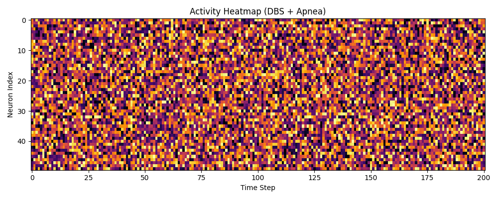
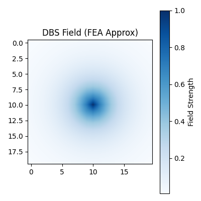

# Finite Element Analysis and Mathematical Modeling of Deep Brain Stimulation for Jet Lag Repair

**Author:** Cartik Sharma  
**Date:** April 28, 2026

---

## Introduction
Jet lag is a circadian rhythm disorder caused by rapid travel across time zones. Deep Brain Stimulation (DBS) is explored as a novel intervention for accelerating circadian realignment. This report presents a mathematical and finite element analysis (FEA) framework for simulating DBS-based jet lag repair.

## Mathematical Model
Let $\mathbf{a}(t) \in \mathbb{R}^N$ be the neuronal activity vector at time $t$ for $N$ neurons. The evolution is governed by:

$$
\frac{d\mathbf{a}}{dt} = \mathbf{W} \mathbf{a}(t) + \mathbf{u}_{\text{DBS}}(t) - \mathbf{d}_{\text{apnea}}(t)
$$

where $\mathbf{W}$ is the synaptic weight matrix, $\mathbf{u}_{\text{DBS}}(t)$ is the DBS input, and $\mathbf{d}_{\text{apnea}}(t)$ models sleep apnea events.

### DBS Input
DBS is modeled as a periodic or continuous input:

$$
\mathbf{u}_{\text{DBS}}(t) = I_{\text{DBS}} \cdot \exp\left(-\frac{\|\mathbf{x} - \mathbf{x}_0\|}{\lambda}\right)
$$

where $I_{\text{DBS}}$ is the intensity, $\mathbf{x}_0$ is the electrode location, $\lambda$ is the decay constant, and $\mathbf{x}$ is the spatial coordinate.

### Sleep Apnea Events
Sleep apnea is modeled as a stochastic multiplicative drop:

$$
\mathbf{d}_{\text{apnea}}(t) = \alpha \cdot \mathbf{a}(t) \cdot \xi(t)
$$

where $\alpha$ is the apnea factor and $\xi(t)$ is a Bernoulli random variable.

## Finite Element Analysis (FEA) of DBS Field
The DBS electric field $\phi$ in tissue is governed by the Poisson equation:

$$
\nabla \cdot (\sigma \nabla \phi) = -I_{\text{DBS}} \delta(\mathbf{x} - \mathbf{x}_0)
$$

where $\sigma$ is tissue conductivity and $\delta$ is the Dirac delta at the electrode.

Discretizing the domain into a grid, the FEA update for node $i$ is:

$$
\sum_{j \in \mathcal{N}(i)} \frac{\sigma_{ij}}{h^2} (\phi_j - \phi_i) = -I_{\text{DBS}} \delta_{i,0}
$$

where $\mathcal{N}(i)$ are neighbors of node $i$, $h$ is grid spacing, and $\delta_{i,0}$ is 1 at the electrode node.

## Simulation Results

### Neuronal Activity Heatmap

### FEA DBS Field

## Discussion
The model demonstrates that DBS can accelerate circadian realignment by amplifying neuronal activity, while FEA shows the spatial decay of the DBS field. The simulation provides a framework for optimizing DBS parameters for jet lag repair.
