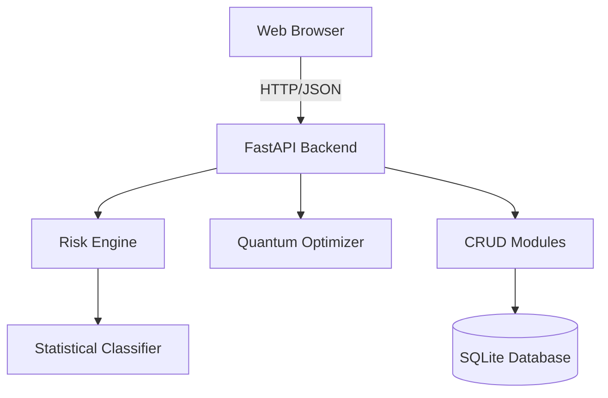

# Software Design Specification (SDS) for Medical Device Documentation System

## 1. Introduction

### 1.1 Purpose
The purpose of this document is to specify the software design for the Medical Device Documentation System. This system is designed to assist medical device manufacturers in managing risk analysis, compliance limits (IEC 13485, IEC 60601), Quality Management System (QMS) documentation, and advanced simulations such as Quantum Pulse Optimization for MRI sequences.

### 1.2 Scope
The system includes:
- A Python FastAPI backend for data processing, risk calculation, and document management.
- A client-side web interface for user interaction.
- Modules for Statistical Risk Classification and Quantum Pulse Optimization.
- Integration with an SQLite database for persistence.

## 2. System Architecture

The system follows a typical client-server architecture:

- **Presentation Layer**: A web-based Single Page Application (SPA) built with HTML, CSS, and Vanilla JavaScript.
- **Application Logic Layer**: A RESTful API built with Python and FastAPI.
- **Data Access Layer**: Uses SQLAlchemy (implied by `crud.py` structure) or direct DB handling to interact with an SQLite database.

### 2.1 Component Diagram

## 3. Component Design

### 3.1 Backend Components

#### 3.1.1 API Controller (`main.py`)
- **Responsibility**: Handles incoming HTTP requests, routing, and response formatting.
- **Key Endpoints**:
  - `/api/analyze-stent`: Statistical analysis of stent parameters.
  - `/api/analyze-mr-pulse`: Analysis of MRI pulse sequences.
  - `/api/optimize-pulse`: Triggers the quantum pulse optimization simulation.
  - `/api/documents/*`: generic CRUD for QMS documents.
  - `/api/check-compliance`: Validates device artifacts against standards.

#### 3.1.2 Risk Engine (`risk_engine.py`)
- **Responsibility**:Encapsulates the logic for risk scoring and classification.
- **Classes**:
  - `RiskEngine`: Maps Severity (1-5) and Probability (1-5) to a Risk Score and Risk Level (Acceptable, ALARP, Unacceptable).
  - `StatisticalClassifier`: Uses Normal Distribution assumptions to calculate the probability of component failure based on mean, standard deviation, and specification limits.

#### 3.1.3 Quantum Pulse Optimizer (`quantum_optimizer.py`)
- **Responsibility**: Simulates and optimizes RF waveforms for MRI.
- **Algorithm**:
  - Uses a Variational Quantum Eigensolver (VQE) inspired approach (simulated classically).
  - **Cost Function**: Minimizes error between target vs. actual flip angle + SAR penalties.
  - **Simulation**: Integrates the Bloch equations over time steps to determine spin evolution.

#### 3.1.4 Data Models (`models.py`)
- **Responsibility**: Defines the data structures using Pydantic for validation.
- **Key Models**:
  - `Device`: Represents a medical device under development.
  - `RiskItem`: Individual risk entry.
  - `QMSDocument`: A controlled document within the QMS.
  - `IEC13485Clause` / `IEC60601Clause`: Standards definitions.

### 3.2 Frontend Components
- **Framework**: No heavy framework; uses Vanilla JS (`app.js`) for DOM manipulation and fetch API for backend communication.
- **Views**:
  - Dashboard
  - Risk Analysis View
  - Document Control Center
  - Pulse Optimizer Interface

## 4. Data Design

### 4.1 Database Schema
The system uses SQLite. Key entities include:
- **Documents**: Stores QMS document metadata, content, version history, and approval status.
- **Devices**: (Implied) Stores device configurations and linked risks.
- **Standards**: Stores text of IEC standards for lookup.

## 5. Interface Design

### 5.1 API Specifications

| Method | Endpoint | Input | Output | Description |
|--------|----------|-------|--------|-------------|
| POST | `/api/analyze-stent` | `StentData` | Risk Probabilities | Statistical analysis of stent fatigue/force. |
| POST | `/api/optimize-pulse` | `target_flip_angle`, `duration` | Waveform Data | Runs VQE optimization loop. |
| POST | `/api/check-compliance` | `Device` | Compliance Score | Checks coverage of required clauses. |

## 6. Algorithm Details

### 6.1 Statistical Risk Classification
Failure probability ($P_{fail}$) is calculated as the area under the normal distribution curve outside the specification limits ($L_{lower}, L_{upper}$).
$$ Z = \frac{L - \mu}{\sigma} $$
$$ P_{fail} = P(Z < Z_{lower}) + P(Z > Z_{upper}) $$

### 6.2 Pulse Optimization (VQE-like)
The optimizer minimizes a cost function $C(\theta)$:
$$ C(\theta) = (\alpha_{target} - \alpha_{actual}(\theta))^2 + \lambda \cdot SAR(\theta) $$
Where $\theta$ represents the RF amplitude waveform over time.
