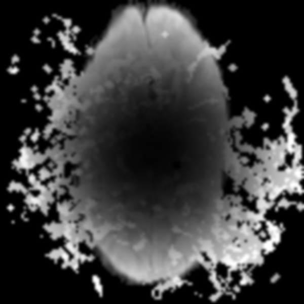

# NeuroPulse Clinical Physics Report
**Date:** January 10, 2026
**Simulation ID:** QuantumBerryPhase-standard

---

## 1. Executive Summary
This report details the simulation results for the **Standard** operating with **QuantumBerryPhase**.

## 2. Physics & Circuit Topology
The Birdcage Coil utilizes a ladder network to create a homogeneous B1 field.

### Coil Derivation
$$ \omega_m = \frac{1}{\sqrt{L_{leg} C_{ring}}} [2 \sin(\frac{m\pi}{N})]^{-1} $$

### Pulse Sequence Physics
$$ S \propto M_0 e^{-TE/T2^*} e^{i(\Phi_{dyn} + \Phi_B)} $$

---

## 3. Finite Math & Discrete Derivations
$$ M_z^{sub} = M_z(t) \cdot e^{-\Delta t/T1} + M_0(1 - e^{-\Delta t/T1}) $$
$$ Z_{ij} = \sum \frac{\mu_0}{4\pi} \frac{\mathbf{J}_i \cdot \mathbf{J}_j}{|\mathbf{r}_{ij}|} \Delta A_k $$

---

## 4. Visual Reconstruction Data

## 5. Metrics
* **Contrast:** 0.6167
* **Sharpness:** 3.23
