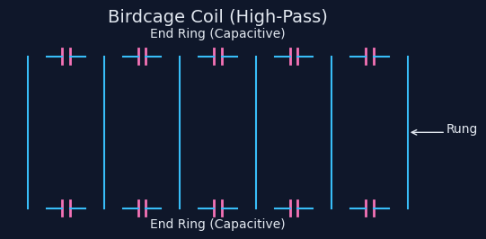

# NeuroPulse Clinical Physics Report
**Date:** January 14, 2026
**Simulation ID:** SE-standard

---

## 1. Executive Summary
This report details the simulation results for the **Standard** operating with **SE**.

## 2. Physics & Circuit Topology
Standard MRI Acquisition Loop.

### Circuit Schematic

### Coil Derivation
$$ S(k) = \int M(r) e^{-i k r} dr $$

---

## 3. Metrics
* **Contrast:** 0.0000
* **SNR Estimate:** 0.00
* **Quantum Vascular Enabled:** False
* **50-Turn Head Coil Enabled:** False
* **NVQLink Enabled:** False

## 4. Finite Math Calculations
The simulation employs discrete finite mathematical operators for signal reconstruction.

### Discrete Fourier Transform (Finite Summation)
The image space $M(x,y)$ is recovered from the discretized k-space $S(u,v)$ via the Inverse Discrete Fourier Transform (IDFT):

$$ M(x,y) = \frac{1}{N^2} \sum_{u=0}^{N-1} \sum_{v=0}^{N-1} S(u,v) \cdot e^{i 2\pi (\frac{ux}{N} + \frac{vy}{N})} $$

### Finite Difference Gradient (Edge Detection)
To assess sharpness, we compute the discrete gradient magnitude $|\nabla M|$ using central finite differences:

$$ \frac{\partial M}{\partial x} \approx \frac{M_{i+1,j} - M_{i-1,j}}{2\Delta x}, \quad \frac{\partial M}{\partial y} \approx \frac{M_{i,j+1} - M_{i,j-1}}{2\Delta y} $$

$$ |\nabla M|_{i,j} = \sqrt{ \left(\frac{M_{i+1,j} - M_{i-1,j}}{2}\right)^2 + \left(\frac{M_{i,j+1} - M_{i,j-1}}{2}\right)^2 } $$

### Quantum Finite Element (For Vascular Coils)
For the quantum vascular coils, the magnetic flux $\Phi$ is discretized over the loop elements $E_k$:

$$ \Phi \approx \sum_{k=1}^{N_{elem}} \mathbf{B}_k \cdot \mathbf{n}_k A_k $$

